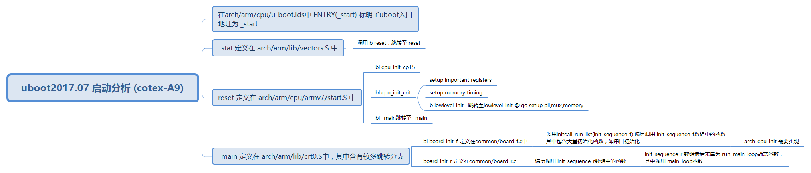

# U-BOOT 2017.07 启动分析 (cotex-A9)
## uboot 链接脚本
uboot 链接脚本为 ***arch/arm/cpu/u-boot.lds*** 该文件标明了uboot的入口地址：***ENTRY(_start)***
## uboot执行
1. _start 定义在 ***arch/arm/lib/vectors.S*** 中

```asm
.globl _start
_start:

#ifdef CONFIG_SYS_DV_NOR_BOOT_CFG
	.word	CONFIG_SYS_DV_NOR_BOOT_CFG
#endif

	b	reset
	ldr	pc, _undefined_instruction
	ldr	pc, _software_interrupt
	ldr	pc, _prefetch_abort
	ldr	pc, _data_abort
	ldr	pc, _not_used
	ldr	pc, _irq
	ldr	pc, _fiq
```  
在其中， 调用 ***b reset *** 跳转至 ***reset***

- reset 定义在 ***arch/arm/cpu/armv7/start.S***中

```asm
/* the mask ROM code should have PLL and others stable */
#ifndef CONFIG_SKIP_LOWLEVEL_INIT
bl	cpu_init_cp15
#ifndef CONFIG_SKIP_LOWLEVEL_INIT_ONLY
bl	cpu_init_crit
#endif
#endif

bl	_main
```
***bl cpu_init_crit *** 跳转至 ***cpu_init_crit***, *** 跳转至 ***cpu_init_crit***,中调用：
```asm
b	lowlevel_init		@ go setup pll,mux,memory
```

最后， reset 中调用 *** b -main***跳转只 _main

- _main 位于 ***arch/arm/lib/crt0.S*** 其中含有大量跳转语句
其中 ***bl board_inuit_f*** 进行板级初始化

- board_inuit_f 位于***commom/board_f.c***中

```c
void board_init_f(ulong boot_flags)
{
#ifdef CONFIG_SYS_GENERIC_GLOBAL_DATA
	/*
	 * For some architectures, global data is initialized and used before
	 * calling this function. The data should be preserved. For others,
	 * CONFIG_SYS_GENERIC_GLOBAL_DATA should be defined and use the stack
	 * here to host global data until relocation.
	 */
	gd_t data;

	gd = &data;

	/*
	 * Clear global data before it is accessed at debug print
	 * in initcall_run_list. Otherwise the debug print probably
	 * get the wrong value of gd->have_console.
	 */
	zero_global_data();
#endif

	gd->flags = boot_flags;
	gd->have_console = 0;

	if (initcall_run_list(init_sequence_f))
		hang();

#if !defined(CONFIG_ARM) && !defined(CONFIG_SANDBOX) && \
		!defined(CONFIG_EFI_APP) && !CONFIG_IS_ENABLED(X86_64)
	/* NOTREACHED - jump_to_copy() does not return */
	hang();
#endif
}
```



